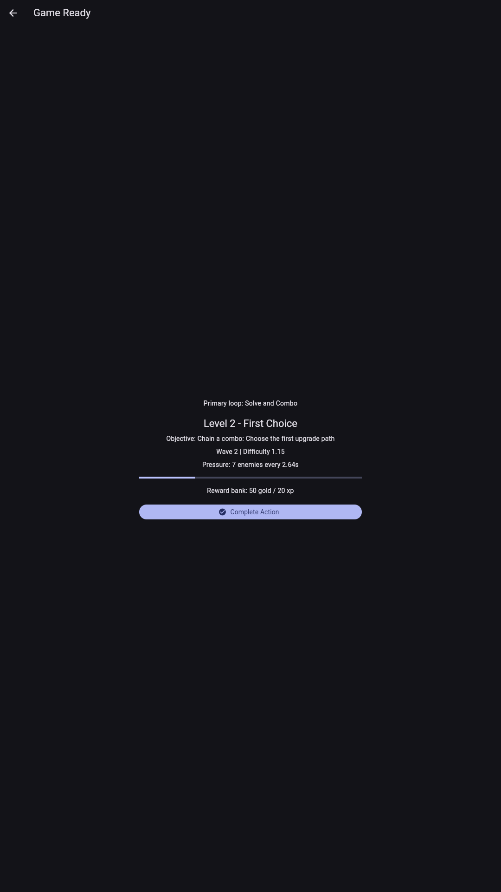

# MG-0006: Card Battler

> **Genre:** Card Game  
> **Platform:** Android / iOS / Web  
> **Engine:** Flutter + Flame

## Overview

Strategic card battle game

<!-- MG-GAME-SHOWCASE:START -->
## Gameplay Showcase



**Hero Auto Battle Arena** centers on the **Solve and Combo** loop. The player enters from the main menu, reads the active objective and pressure state, performs the core action, banks rewards, then returns through roadmap and retention goals.

- **Primary flow:** Main menu -> Start Game -> Gameplay objective -> Complete Action -> Reward bank -> Level roadmap -> Return loops.
- **Level design:** 8-stage progression from `L1 Onboarding: Chain a combo: Learn the core action` to `L8 Repeatable Loop: Chain a combo: Return for a harder run and better reward`.
- **Pacing:** difficulty `1 -> 3.15`, rewards `50g/20xp -> 525g/240xp`, pressure `5 -> 19`.
- **Unlock cadence:** tutorial complete, daily quest, upgrade option, booster, collection slot.
- **Meta progression:** DailyQuest, Achievement, BattlePass, Gacha, Collection, Progression.
- **Verification:** Fun E2E, level balancing, and Flutter analyze are covered by the game-loop verification suite.
<!-- MG-GAME-SHOWCASE:END -->
## Tech Stack

- **Framework:** Flutter 3.x
- **Game Engine:** Flame 1.x
- **State Management:** Riverpod
- **Common Library:** mg_common_game (submodule)

## Project Structure

```
mg-game-0006/
├── game/                    # Main game project
│   ├── lib/
│   │   ├── game/           # Game logic
│   │   ├── features/       # Feature modules
│   │   └── ui/             # UI components
│   └── assets/             # Game assets
├── libs/                    # Shared libraries (submodules)
│   ├── mg_common_game/     # Common game utilities
│   ├── mg_common_analytics/
│   ├── mg_common_backend/
│   └── mg_common_infra/
└── common/                  # Legacy common module
```

## Getting Started

```bash
# Clone with submodules
git clone --recursive https://github.com/monthly-games/mg-game-0006.git

# Install dependencies
cd game
flutter pub get

# Run
flutter run
```

## Features

- [x] Core gameplay
- [x] Gacha system
- [x] BattlePass system
- [x] VFX effects
- [x] Audio system
- [ ] Leaderboards
- [ ] Cloud save

## License

MIT License - Monthly Games Portfolio Project
